# comfyui-missed-tool

A few tools for [ComfyUI](https://github.com/comfyanonymous/ComfyUI), perhaps one of them is exactly what you need.

## Installation

Clone the repository into `ComfyUI/custom_nodes` and install its dependencies:

```bash
git clone https://github.com/ifmylove2011/comfyui-missed-tool.git
cd comfyui-missed-tool
pip install -r requirements.txt
```

Restart ComfyUI and refresh the browser after installation or an update.

## Table of contents

- [XY Plot for Z-Image / Krea 2](#xy-plot-for-z-image--krea-2)
- [Image Queue Loader](#imagequeueloader)
- [Load Image Alpha](#loadimagealpha)
- [TrimBG](#trimbg)
- [TxtSave](#txtsave)
- [TextSplit](#textsplittolist)
- [ScaleMultiPixels](#scalemultipixels)
- [LoRA Merge](#loramerge)
- [Color Image Fill/Remove](#colorimagefillrm)
- [Face Similarity Check](#facesimilaritycheck)

## XY Plot for Z-Image / Krea 2

The independent XY Plot nodes are available under `missed tool/XY Plot`. They are designed around the standard KSampler workflow used by Z-Image and Krea 2, with optional support for custom `SAMPLER` and `SIGMAS` inputs.

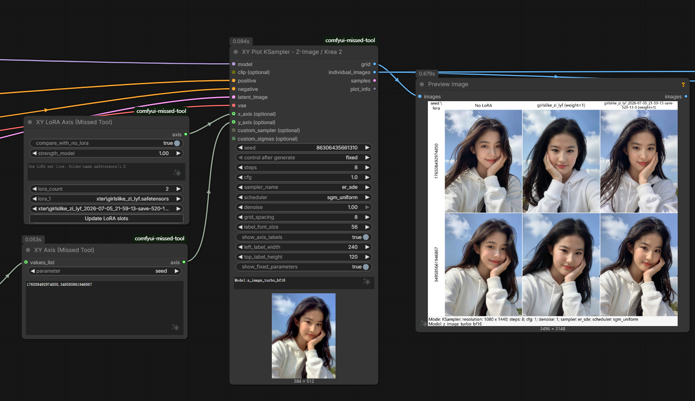

### XY Plot KSampler - Z-Image / Krea 2

The main node samples every X/Y combination, decodes the results, and returns:

- `grid`: the completed labeled grid.
- `individual_images`: decoded images in row-major order for scoring or other per-image processing.
- `samples`: the generated latent batch.
- `plot_info`: fixed sampling and display information that can be passed to the footer composer.

Connect `MODEL`, positive/negative conditioning, a latent, and a VAE as with a normal KSampler. `clip (optional)` is required only when an `XY Prompt Axis` is used. The `x_axis`, `y_axis`, `custom_sampler`, and `custom_sigmas` sockets are also optional. If neither axis is connected, the node produces one base image.

Z-Image and Krea 2 can both use the normal KSampler controls on the node. For a SamplerCustom-style workflow, connect both `custom_sampler` and `custom_sigmas`; sampler and scheduler axes are available only in standard KSampler mode.

Axis labels appear above and to the left of the grid. `show_axis_labels` hides or shows them, while `top_label_height`, `left_label_width`, and `label_font_size` control their layout. Long labels wrap and shrink only when they still cannot fit. `extra_info` is display-only text for information such as model and VAE names; separate entries with semicolons:

```text
Model: z_image_turbo_bf16; VAE: flux-ae.safetensors; Note: comparison test
```

The information band also reports the decoded resolution and sampling parameters that are not controlled by an axis. Layout-only changes reuse cached samples, and changing the VAE re-decodes cached latents without sampling again.

### XY Axis

`XY Axis (Missed Tool)` supports these parameters:

- `seed`
- `steps`
- `cfg`
- `denoise`
- `sampler`
- `scheduler`

Enter multiple values on separate lines or separate them with commas or semicolons. The optional `values_list` socket accepts primitive values, tensors/arrays, and ComfyUI list outputs; a connected list overrides the text field.

`XY Sampler Axis` and `XY Scheduler Axis` provide dropdowns for valid ComfyUI choices plus an additional text list for exact names.

### XY LoRA Axis

`XY LoRA Axis` compares different LoRAs. Set `lora_count` from 1 to 100 and click `Update LoRA slots` to change the number of dropdowns. Reducing the count hides surplus selectors without discarding their values. Existing workflows made with the former eight fixed selectors are migrated automatically.

- `strength_model` is the default strength for dropdown selections.
- `compare_with_no_lora` adds a `No LoRA` coordinate. It does not remove LoRAs already applied upstream.
- `additional_loras` accepts an unlimited line-based list. Append `|weight` to override the default strength for that entry, for example `folder\\name.safetensors|0.8`.

Axis LoRAs are applied to `MODEL` only. `XY LoRA Weight Axis` instead selects one LoRA and varies its model strength; a strength of `0` represents no LoRA from that axis.

### XY Prompt Axis

`XY Prompt Axis` compares positive or negative prompts. Enter one prompt per line or connect a `STRING` list. Commas and semicolons remain part of the prompt. Connect `CLIP` to the main XY Plot node so each cell can be encoded independently.

### XY Cell Footer Composer

This node appends an additional image below every individual XY cell and then rebuilds the labeled grid. It is useful for similarity scores, quality metrics, captions, or other rendered metadata.

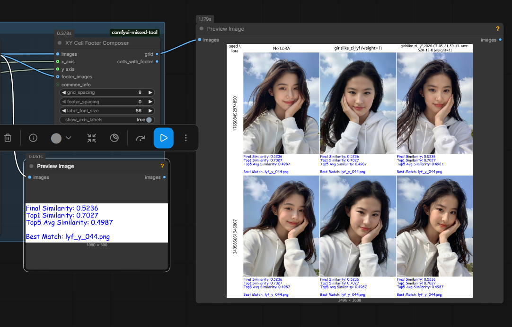

Connect the main node's `individual_images` to `images`, the rendered score/caption batch to `footer_images`, and the same X/Y axes to the composer. Connect `plot_info` to `common_info` if the final grid should retain the fixed-parameter band. One footer image is repeated for every cell; a footer batch is matched to cells in row-major order.

### Example workflow

[Download the complete Z-Image XY Plot with per-cell footer workflow](./assets/zimage_xyplot_with_footer.json).

The example compares LoRAs and seeds, evaluates each generated image, renders the report as an image, and attaches it below the corresponding cell. Replace its local model, LoRA, font, and reference-directory values with paths available in your installation. The scoring/text-rendering portion also uses nodes outside this plugin, so ComfyUI may prompt you to install those dependencies.

## Other nodes

### ImageQueueLoader

Load images in a queue and retrieve metadata such as the seed from generated images. Seeds can be retrieved sequentially during sequential execution.

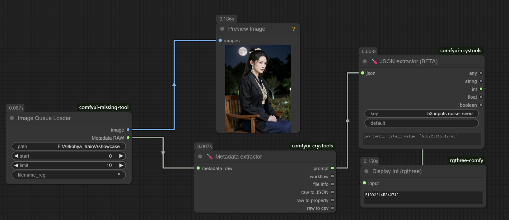

### LoadImagealpha

Load images with an alpha channel. ComfyUI's built-in Load Image node outputs RGB by default; it can also be used together with its mask output.

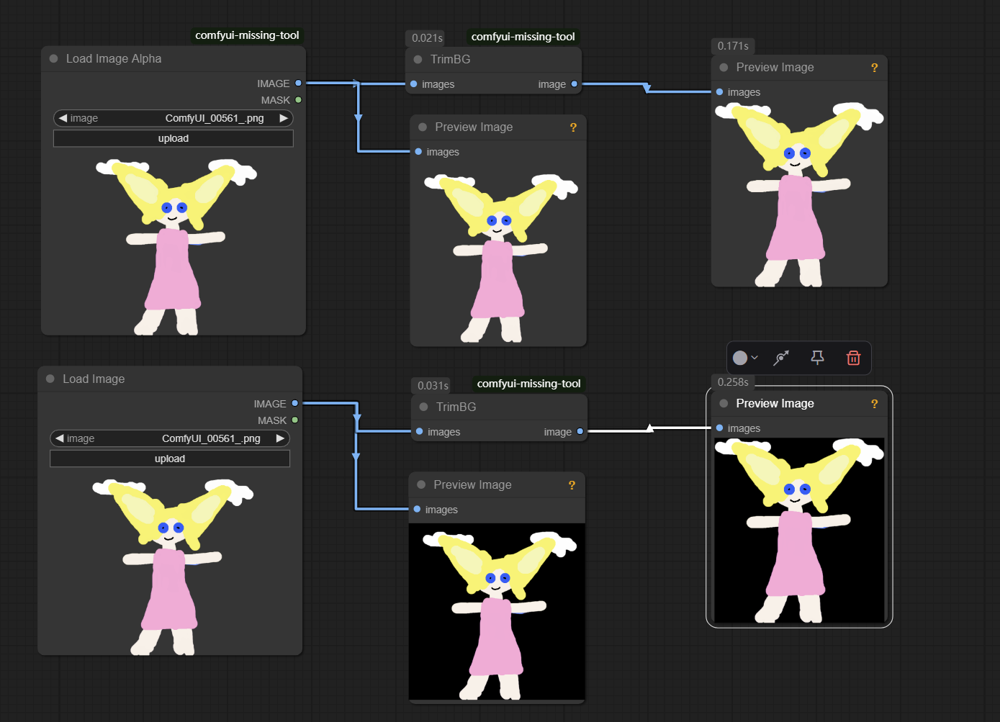

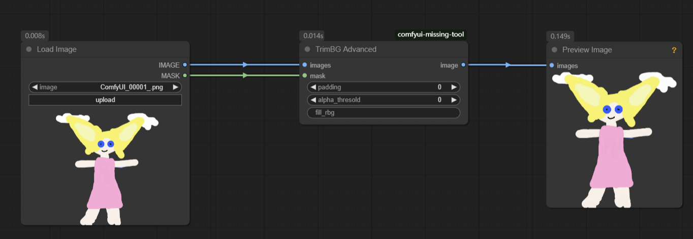

### TrimBG

Batch-read and process images. It works well with [Load Image List From Dir](https://github.com/ltdrdata/ComfyUI-Inspire-Pack?tab=readme-ov-file#image-util), using a list rather than a batch.

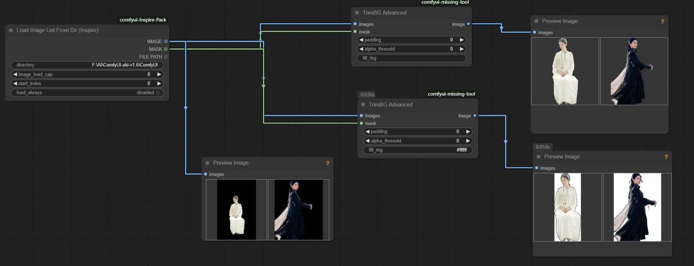

It can also be used with [ComfyUI_BiRefNet_ll](https://github.com/lldacing/ComfyUI_BiRefNet_ll).

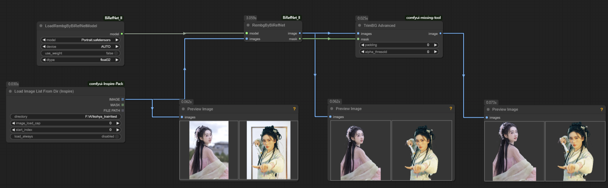

### TxtSave

Save text using an input file path and name when `src_mode` is enabled.

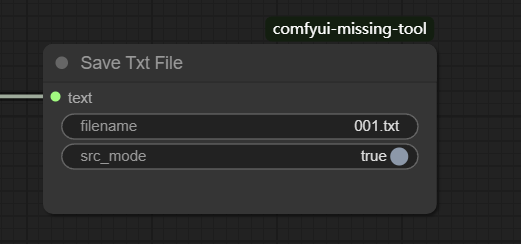

### TextSplitToList

Split text into a list with a plain delimiter or regular expression, and return both the list and the text with delimiters removed.

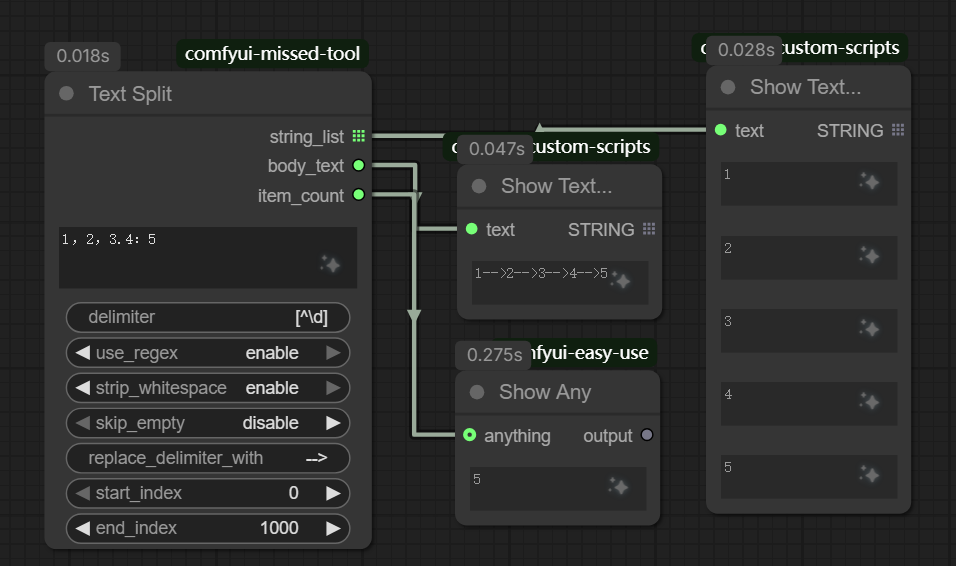

### ScaleMultiPixels

Scale an image to a multiple of the selected pixel value. For example, with a 533 × 433 input and `base_pixel` set to 100, the output is 500 × 400.

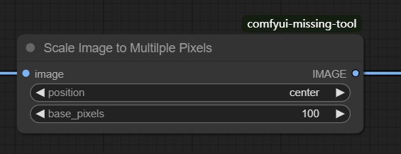

### LoraMerge

Load, merge, and save LoRAs through three flexible nodes.

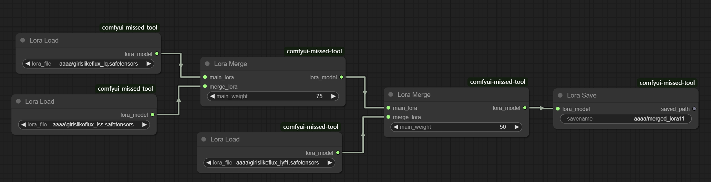

### ColorImageFillRm

Replace or remove pixels of a selected color, useful when mask images are overlaid with other layers.

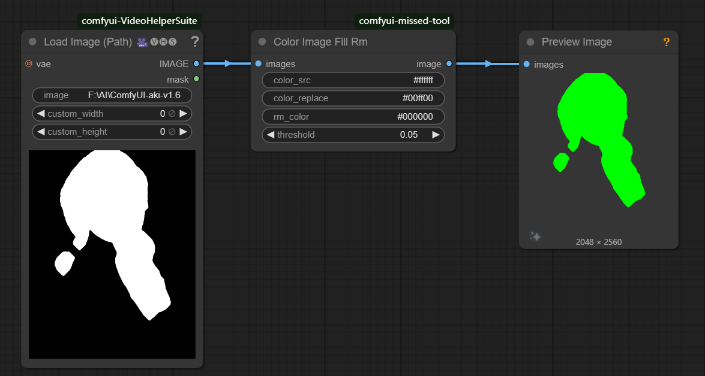

### FaceSimilarityCheck

Compare an input face against images in a reference directory. The nodes return similarity scores, the best-matching filename, a readable Top-K report, and JSON results for downstream workflows. Reference embeddings are cached in `cache_dir` to speed up later runs.

- **Face Similarity Check** uses `face_recognition` embeddings and cosine similarity.
- **Face Similarity Check (Insight)** uses the InsightFace `buffalo_l` model.
- **Face Similarity Check (Hybrid)** ranks with `face_recognition` similarity and applies an ArcFace penalty to obvious mismatches. Configure `arcface_penalty_threshold` and `penalty_factor` for stricter rejection.
- **Face Identity Similarity (antelopev2)** builds a 512-dimensional identity centroid from `reference_dir`, can remove reference outliers, and returns `similarity`, `passed`, `best_match`, an aligned face crop, and a detailed report. This node requires the CUDA-enabled ONNX Runtime provider.

Set `source_dir` or `reference_dir` to a directory containing reference images. PNG, JPG, JPEG, WebP, and, where supported, BMP files are accepted. A clear, front-facing reference set generally produces the most stable results.

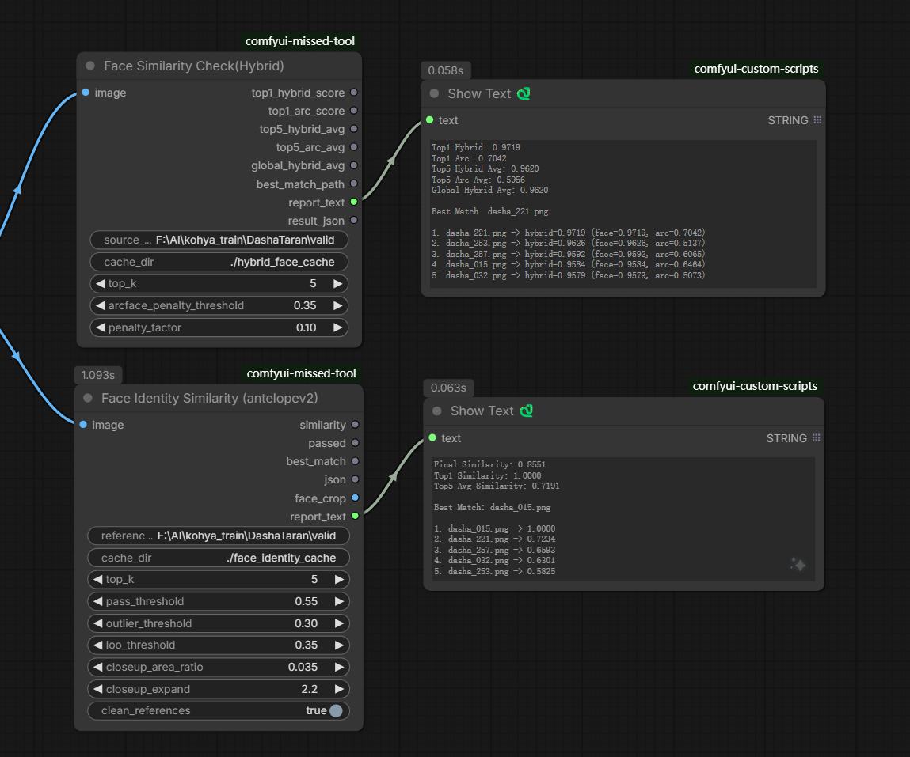

## Contributing

Please fork the repository and create a pull request.

## License

comfyui-missed-tool is licensed under the MIT License. See [LICENSE](./LICENSE) for details.

## Contact

For questions or feedback, please open an issue on GitHub or contact the repository owner.
