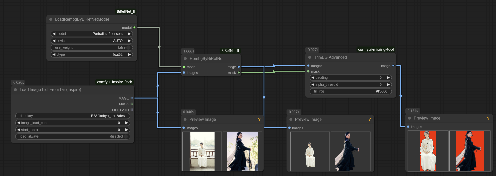

# comfyui-missed-tool
A few tools for [ComfyUI](https://github.com/comfyanonymous/ComfyUI), perhaps it's exactly what you need.

## Installation

To install comfyui-missed-tool, clone the repository and install the dependencies:

```bash
git clone https://github.com/ifmylove2011/comfyui-missed-tool.git
cd comfyui-missed-tool
pip install -r requirements.txt
```

## Table of contents
- [Image Queue Loader](#ImageQueueLoader)
- [Load Image alpha](#LoadImagealpha)
- [TrimBG](#TrimBG)
- [TxtSave](#TxtSave)
- [TextSplit](#TextSplit)
- [ScaleMultiPixels](#ScaleMultiPixels)
- [Lora Merge](#LoraMerge)
- [ColorImageFillRm](#ColorImageFillRm)


### ImageQueueLoader
Load Images in Queue, it is possible to obtain metadata information, such as seed, from the generated images in a queue. 
We can retrieve seeds sequentially during sequential execution.

### LoadImagealpha
Load Image with alpha, it works when transparent images exits. Built-in load-image extension output is "RGB" default, not "RGBA".

Of course, we can also use the built-in load image of Comfyui, but it needs to be used in conjunction with a mask.

### TrimBG
We can also batch read images and process them. Better with [Load Image List From Dir](https://github.com/ltdrdata/ComfyUI-Inspire-Pack?tab=readme-ov-file#image-util), list, not batch.

And, Better to use with [ComfyUI_BiRefNet_ll](https://github.com/lldacing/ComfyUI_BiRefNet_ll)

### TxtSave
Save txt file with input file path and name if "src_mode" enable.
### TextSplitToList
Splitting a text or string into a list, you can use regular expressions to cut any string and output the list and the result after removing the delimiter.

### ScaleMultiPixels
Scale image to multiple pixels.
A input picture pixels is 533 * 433, if base_pixel set 100, output will be 500 * 400.

### LoraMerge
Load Lora, Merge Load, and Save Lora.
Combination is relatively more flexible, correspondingly, there are more nodes, totaling three!

### ColorImageFillRm
Simple color replacement and removal of color pixels are useful in certain scenes where mask images are overlaid with layers.


## Contributing

If you want to contribute to comfyui-missed-tool, please fork the repository and create a pull request with your changes.

## License

comfyui-missed-tool is licensed under the MIT License. See the LICENSE file for more details.

## Contact

For any questions or feedback, please open an issue on GitHub or contact the repository owner.

Enjoy.
